# JedaIn — System Flow

**Version:** 0.1  
**Date:** 30 Agustus 2026  
**Source of Truth:** [`../PRD.md`](../PRD.md)  
**Status:** Working System Flow

> Dokumen ini menerjemahkan PRD menjadi alur sistem yang dapat langsung digunakan untuk membuat screen inventory, wireframe, prototype, state model, database schema, dan API contract. Jika ada konflik, product rule pada `PRD.md` harus diperbarui terlebih dahulu lalu flow ini diselaraskan.

---

# 1. Design Principles

1. **No guest mode.** Traveler harus memiliki akun.
2. **Register first, quiz second.** First-time traveler wajib menyelesaikan onboarding quiz.
3. **Current intent first.** Quiz terbaru menjadi sinyal rekomendasi utama.
4. **One active pending payment.** Traveler tidak boleh membuat checkout/payment baru selama masih ada pending payment aktif.
5. **Browsing is never blocked by pending payment.** Yang diblok hanya creation of a new checkout/payment.
6. **Package ≠ Session.** Traveler memilih dan membeli session konkret dari package.
7. **Verified review only.** Rating hanya dari booking `COMPLETED`.
8. **Traveler, Partner, Admin are separate product surfaces.** Backend/identity tidak harus terpisah.
9. **Critical rules are server-side.** UI filter, countdown, role visibility, dan capacity display tidak boleh menjadi source of truth.
10. **Manual MVP is acceptable where the business model explicitly requires human trust/approval.**

---

# 2. Product Surface Map

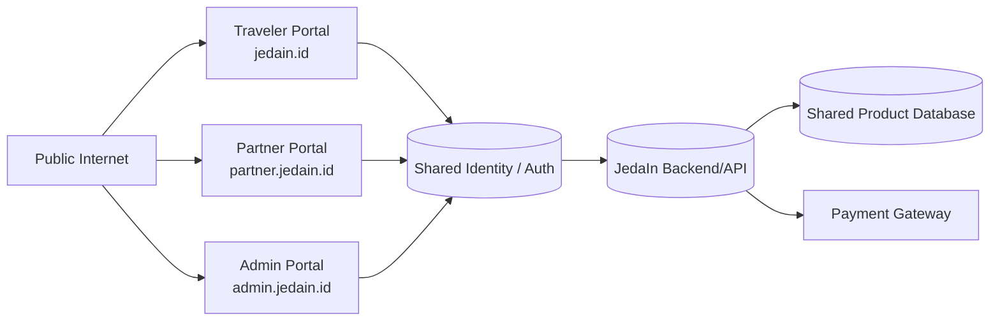
```mermaid
flowchart LR
    A[Public Internet] --> T[Traveler Portal\njedain.id]
    A --> P[Partner Portal\npartner.jedain.id]
    A --> AD[Admin Portal\nadmin.jedain.id]

    T --> I[(Shared Identity / Auth)]
    P --> I
    AD --> I

    I --> API[(JedaIn Backend/API)]
    API --> DB[(Shared Product Database)]
    API --> PG[Payment Gateway]
```

### Surface responsibilities

| Surface | Primary Users | Main Purpose |
|---|---|---|
| Traveler Portal | Traveler | Quiz, discovery, recommendation, booking, trip, review |
| Partner Portal | EO + Mitra Destinasi | Insight, package creation, operations, destination management |
| Admin Portal | Internal JedaIn | Verification, approval, trust, complaint, financial oversight |

Implementation MVP boleh memakai route `/`, `/partner`, `/admin` dalam satu codebase. Subdomain adalah target product boundary, bukan requirement untuk membuat tiga backend berbeda.

---

# 3. Golden Demo Flow


```mermaid
flowchart LR
    A[Traveler Register] --> B[Mandatory Quiz]
    B --> C[Personal Recommendation]
    C --> D[Demand Data Aggregated]
    D --> E[EO Opens Insight]
    E --> F[EO Creates Package]
    F --> G[Admin Reviews]
    G --> H[Package LIVE]
    H --> I[Traveler Chooses Session]
    I --> J[Checkout + Payment Countdown]
    J --> K[Booking PAID]
    K --> L[Trip COMPLETED]
    L --> M[Venue Rating + EO Rating]
    M --> N[Trust + New Insight]
```

**Prototype priority:** seluruh UI yang diperlukan untuk flow ini harus selesai sebelum nice-to-have screen.

---

# 4. Traveler System Flow

## 4.1 Entry, Authentication & Mandatory Onboarding

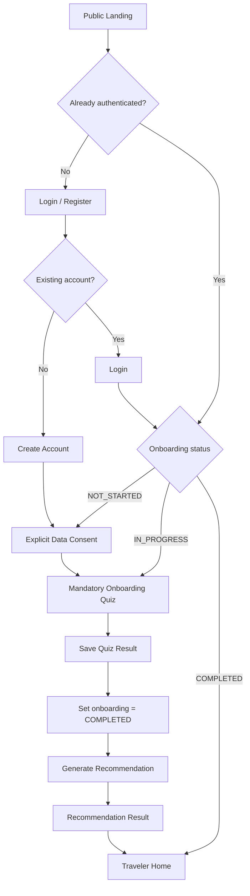
```mermaid
flowchart TD
    A[Public Landing] --> B{Already authenticated?}

    B -- No --> C[Login / Register]
    C --> D{Existing account?}

    D -- No --> E[Create Account]
    E --> F[Explicit Data Consent]
    F --> G[Mandatory Onboarding Quiz]
    G --> H[Save Quiz Result]
    H --> I[Set onboarding = COMPLETED]
    I --> J[Generate Recommendation]
    J --> K[Recommendation Result]
    K --> L[Traveler Home]

    D -- Yes --> M[Login]
    M --> N{Onboarding status}
    N -- NOT_STARTED --> F
    N -- IN_PROGRESS --> G
    N -- COMPLETED --> L

    B -- Yes --> N
```

### Locked decisions

- Guest mode: **NO**.
- First-time quiz skip: **NO**.
- Quiz before registration: **NO**.
- User closing during onboarding: resume from onboarding state on next login.
- User dapat retake/update quiz setelah onboarding selesai.

### Onboarding state

```text
NOT_STARTED -> IN_PROGRESS -> COMPLETED
```

---

## 4.2 Recommendation Logic

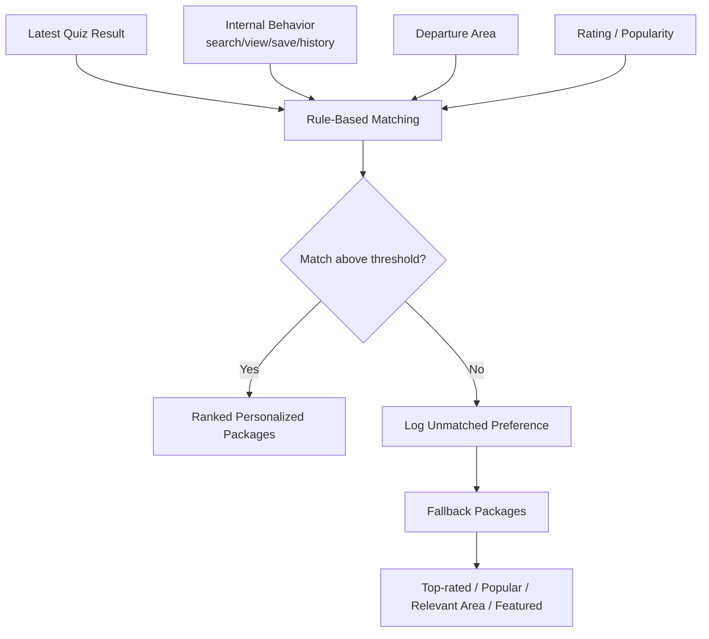
```mermaid
flowchart TD
    A[Latest Quiz Result] --> B[Rule-Based Matching]
    C[Internal Behavior\nsearch/view/save/history] --> B
    D[Departure Area] --> B
    E[Rating / Popularity] --> B

    B --> F{Match above threshold?}
    F -- Yes --> G[Ranked Personalized Packages]
    F -- No --> H[Log Unmatched Preference]
    H --> I[Fallback Packages]
    I --> J[Top-rated / Popular / Relevant Area / Featured]
```

### Priority

1. latest quiz/current intent,
2. behavior internal JedaIn,
3. departure area,
4. rating/popularity.

**Not MVP:** personal Google Search History.

---

## 4.3 Traveler Home States

Home harus bersifat state-aware.

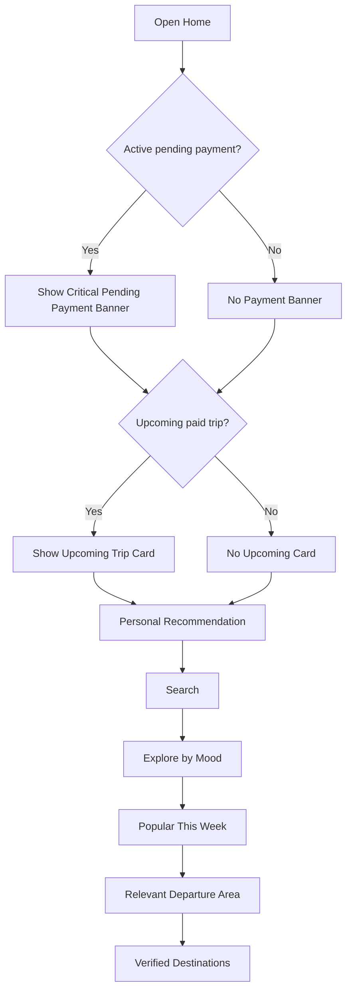
```mermaid
flowchart TD
    A[Open Home] --> B{Active pending payment?}
    B -- Yes --> C[Show Critical Pending Payment Banner]
    B -- No --> D[No Payment Banner]

    C --> E{Upcoming paid trip?}
    D --> E

    E -- Yes --> F[Show Upcoming Trip Card]
    E -- No --> G[No Upcoming Card]

    F --> H[Personal Recommendation]
    G --> H
    H --> I[Search]
    I --> J[Explore by Mood]
    J --> K[Popular This Week]
    K --> L[Relevant Departure Area]
    L --> M[Verified Destinations]
```

### Home priority order

1. pending payment banner,
2. upcoming trip,
3. personalized recommendation,
4. search,
5. explore by mood,
6. popularity,
7. departure-area discovery,
8. verified destination discovery.

---

## 4.4 Discovery to Checkout

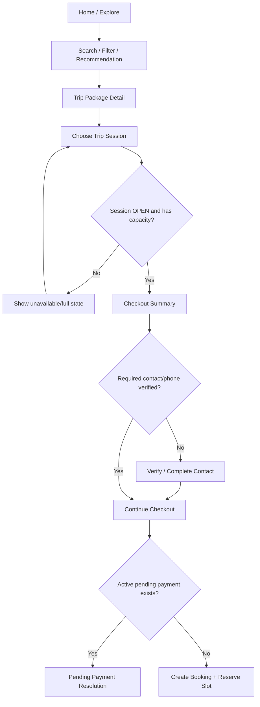
```mermaid
flowchart TD
    A[Home / Explore] --> B[Search / Filter / Recommendation]
    B --> C[Trip Package Detail]
    C --> D[Choose Trip Session]
    D --> E{Session OPEN and has capacity?}

    E -- No --> F[Show unavailable/full state]
    F --> D

    E -- Yes --> G[Checkout Summary]
    G --> H{Required contact/phone verified?}
    H -- No --> I[Verify / Complete Contact]
    I --> J[Continue Checkout]
    H -- Yes --> J

    J --> K{Active pending payment exists?}
    K -- Yes --> L[Pending Payment Resolution]
    K -- No --> M[Create Booking + Reserve Slot]
```

---

# 5. Pending Payment & Capacity Flow

## 5.1 Core Rule

At most **one active pending payment per traveler**.

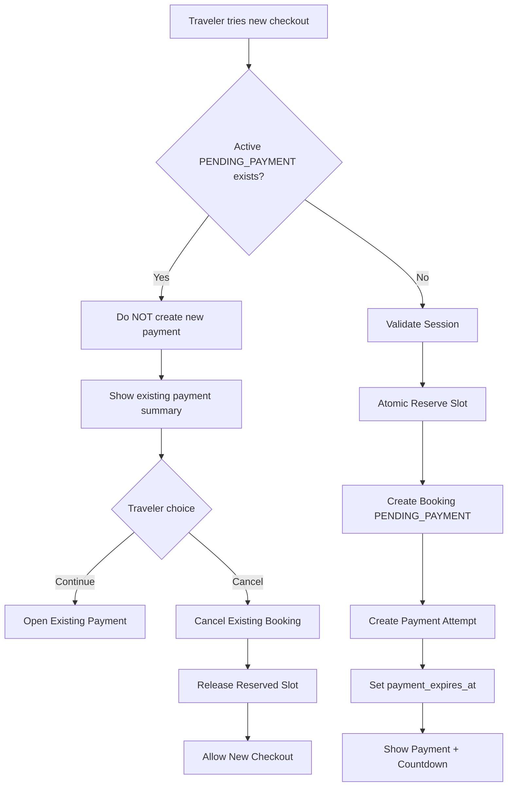
```mermaid
flowchart TD
    A[Traveler tries new checkout] --> B{Active PENDING_PAYMENT exists?}

    B -- Yes --> C[Do NOT create new payment]
    C --> D[Show existing payment summary]
    D --> E{Traveler choice}
    E -- Continue --> F[Open Existing Payment]
    E -- Cancel --> G[Cancel Existing Booking]
    G --> H[Release Reserved Slot]
    H --> I[Allow New Checkout]

    B -- No --> J[Validate Session]
    J --> K[Atomic Reserve Slot]
    K --> L[Create Booking PENDING_PAYMENT]
    L --> M[Create Payment Attempt]
    M --> N[Set payment_expires_at]
    N --> O[Show Payment + Countdown]
```

## 5.2 Payment Resolution

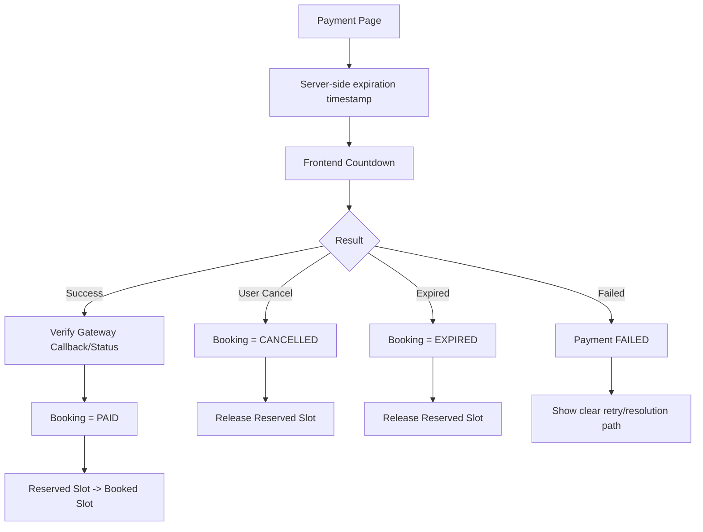
```mermaid
flowchart TD
    A[Payment Page] --> B[Server-side expiration timestamp]
    B --> C[Frontend Countdown]

    C --> D{Result}

    D -- Success --> E[Verify Gateway Callback/Status]
    E --> F[Booking = PAID]
    F --> G[Reserved Slot -> Booked Slot]

    D -- User Cancel --> H[Booking = CANCELLED]
    H --> I[Release Reserved Slot]

    D -- Expired --> J[Booking = EXPIRED]
    J --> K[Release Reserved Slot]

    D -- Failed --> L[Payment FAILED]
    L --> M[Show clear retry/resolution path]
```

### Countdown rule

`payment_expires_at` dari server adalah source of truth.

Frontend countdown tidak boleh menentukan sendiri apakah payment masih valid.

**Proposed default:** 15 minutes — still PENDING team decision.

## 5.3 Late Callback / Race Protection

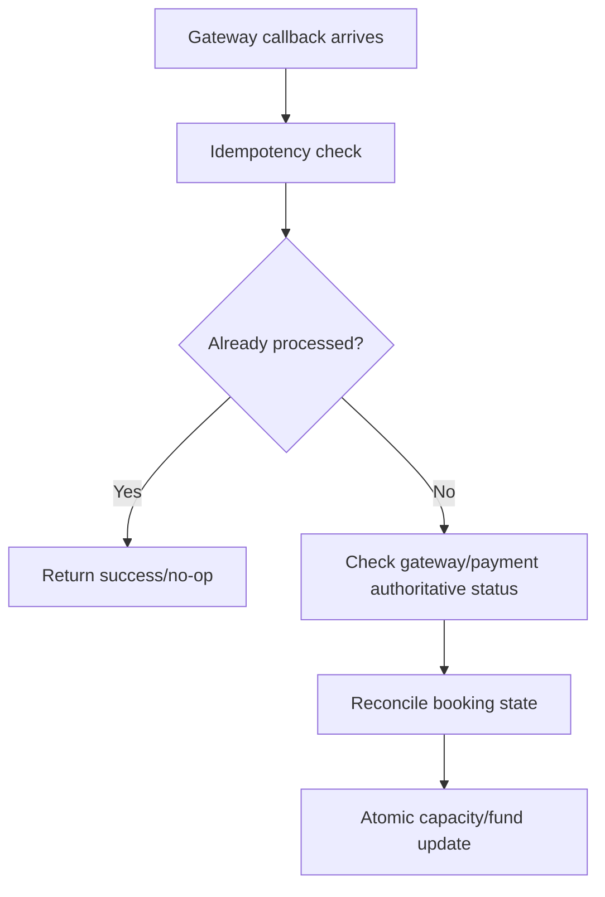
```mermaid
flowchart TD
    A[Gateway callback arrives] --> B[Idempotency check]
    B --> C{Already processed?}
    C -- Yes --> D[Return success/no-op]
    C -- No --> E[Check gateway/payment authoritative status]
    E --> F[Reconcile booking state]
    F --> G[Atomic capacity/fund update]
```

---

# 6. Traveler Trip & Review Flow

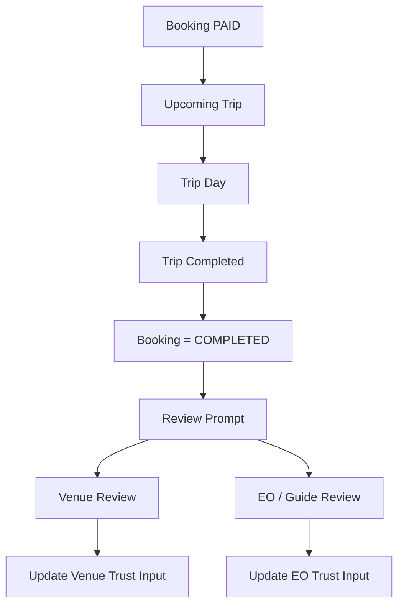
```mermaid
flowchart TD
    A[Booking PAID] --> B[Upcoming Trip]
    B --> C[Trip Day]
    C --> D[Trip Completed]
    D --> E[Booking = COMPLETED]

    E --> F[Review Prompt]
    F --> G[Venue Review]
    F --> H[EO / Guide Review]

    G --> I[Update Venue Trust Input]
    H --> J[Update EO Trust Input]
```

### Review rules

- only `COMPLETED` booking,
- maximum 1 venue review per booking,
- maximum 1 EO review per booking,
- reviews are separate records,
- review is linked to booking.

---

# 7. EO Partner Flow

## 7.1 EO Entry & Application

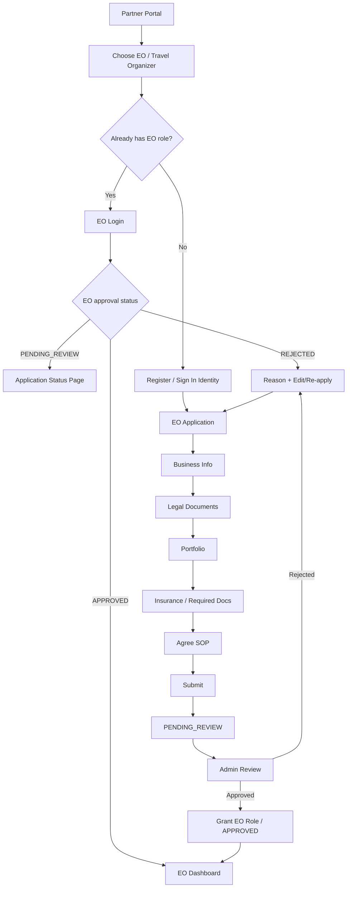
```mermaid
flowchart TD
    A[Partner Portal] --> B[Choose EO / Travel Organizer]
    B --> C{Already has EO role?}

    C -- Yes --> D[EO Login]
    D --> E{EO approval status}
    E -- APPROVED --> F[EO Dashboard]
    E -- PENDING_REVIEW --> G[Application Status Page]
    E -- REJECTED --> H[Reason + Edit/Re-apply]

    C -- No --> I[Register / Sign In Identity]
    I --> J[EO Application]
    J --> K[Business Info]
    K --> L[Legal Documents]
    L --> M[Portfolio]
    M --> N[Insurance / Required Docs]
    N --> O[Agree SOP]
    O --> P[Submit]
    P --> Q[PENDING_REVIEW]
    Q --> R[Admin Review]
    R -- Approved --> S[Grant EO Role / APPROVED]
    S --> F
    R -- Rejected --> H
    H --> J
```

### EO application states

```text
DRAFT -> SUBMITTED -> PENDING_REVIEW -> APPROVED
                                    \-> REJECTED -> edit -> resubmit
```

---

## 7.2 EO Dashboard Information Architecture

```text
Partner / EO
├── Overview
├── Insights
├── Packages
├── Sessions
├── Bookings
├── Destinations
├── Reviews
└── Profile
```

### Overview priority

1. primary CTA: `+ Create Package`,
2. package awaiting approval,
3. upcoming sessions,
4. booking summary,
5. average rating,
6. recent demand insight.

---

## 7.3 Insight to Package Creation

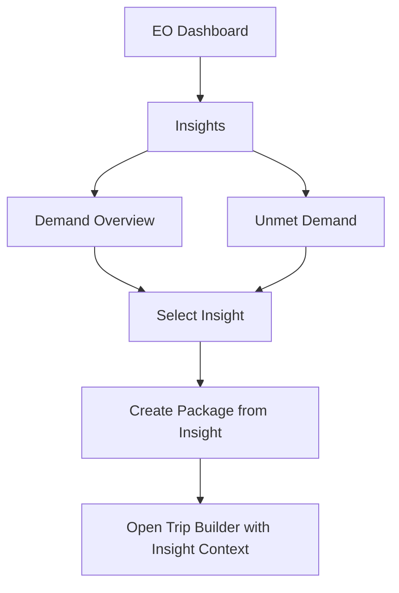
```mermaid
flowchart TD
    A[EO Dashboard] --> B[Insights]
    B --> C[Demand Overview]
    B --> D[Unmet Demand]

    C --> E[Select Insight]
    D --> E

    E --> F[Create Package from Insight]
    F --> G[Open Trip Builder with Insight Context]
```

Minimum Insight UI:

- healing/activity intent distribution,
- budget distribution,
- duration distribution,
- departure area,
- unmet demand cards,
- CTA `Create Package from Insight`.

---

# 8. EO Trip Builder Flow

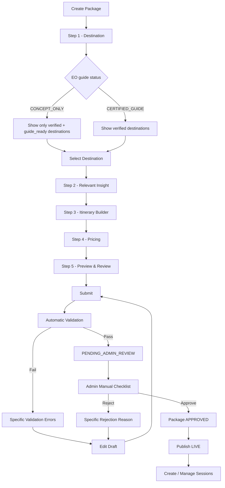
```mermaid
flowchart TD
    A[Create Package] --> B[Step 1 - Destination]
    B --> C{EO guide status}

    C -- CONCEPT_ONLY --> D[Show only verified + guide_ready destinations]
    C -- CERTIFIED_GUIDE --> E[Show verified destinations]

    D --> F[Select Destination]
    E --> F

    F --> G[Step 2 - Relevant Insight]
    G --> H[Step 3 - Itinerary Builder]
    H --> I[Step 4 - Pricing]
    I --> J[Step 5 - Preview & Review]
    J --> K[Submit]

    K --> L[Automatic Validation]
    L -- Fail --> M[Specific Validation Errors]
    M --> N[Edit Draft]
    N --> K

    L -- Pass --> O[PENDING_ADMIN_REVIEW]
    O --> P[Admin Manual Checklist]

    P -- Reject --> Q[Specific Rejection Reason]
    Q --> N

    P -- Approve --> R[Package APPROVED]
    R --> S[Publish LIVE]
    S --> T[Create / Manage Sessions]
```

### Builder stepper

```text
1 Destination
2 Insight
3 Itinerary
4 Pricing
5 Review
```

### Important rule

`CONCEPT_ONLY` EO cannot bypass the `guide_ready = true` destination requirement via frontend manipulation. Backend validates again on submit.

---

# 9. Live Package Editing & Versioning

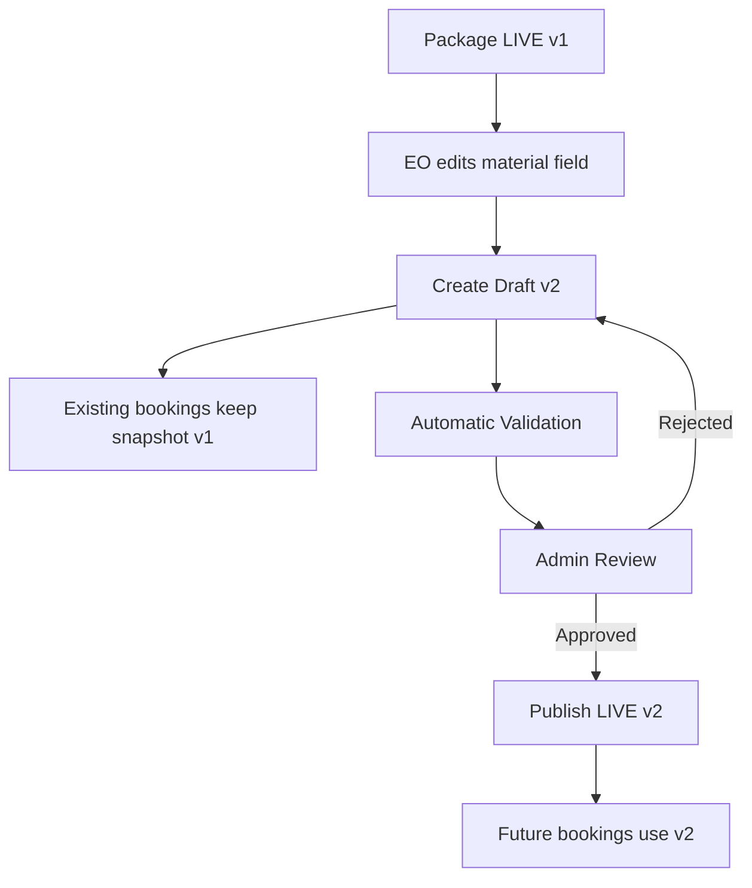
```mermaid
flowchart TD
    A[Package LIVE v1] --> B[EO edits material field]
    B --> C[Create Draft v2]
    C --> D[Existing bookings keep snapshot v1]
    C --> E[Automatic Validation]
    E --> F[Admin Review]
    F -- Rejected --> C
    F -- Approved --> G[Publish LIVE v2]
    G --> H[Future bookings use v2]
```

Material changes include at least:

- price,
- destination,
- main itinerary,
- duration,
- safety information,
- EO/guide.

---

# 10. Destination Partner Flow

## 10.1 Entry & Verification

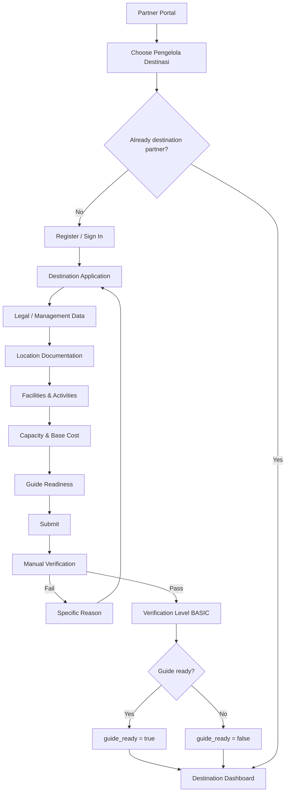
```mermaid
flowchart TD
    A[Partner Portal] --> B[Choose Pengelola Destinasi]
    B --> C{Already destination partner?}

    C -- No --> D[Register / Sign In]
    D --> E[Destination Application]
    E --> F[Legal / Management Data]
    F --> G[Location Documentation]
    G --> H[Facilities & Activities]
    H --> I[Capacity & Base Cost]
    I --> J[Guide Readiness]
    J --> K[Submit]
    K --> L[Manual Verification]

    L -- Fail --> M[Specific Reason]
    M --> E

    L -- Pass --> N[Verification Level BASIC]
    N --> O{Guide ready?}
    O -- Yes --> P[guide_ready = true]
    O -- No --> Q[guide_ready = false]
    P --> R[Destination Dashboard]
    Q --> R

    C -- Yes --> R
```

## 10.2 Destination Dashboard IA

```text
Partner / Destination
├── Overview
├── Destination Profile
├── Verification
├── Sessions / Schedule
├── Capacity
├── Reviews
└── Profile
```

---

# 11. Admin Flow

## 11.1 Admin Dashboard

```text
Admin
├── Overview
├── EO Approvals
├── Destination Verification
├── Package Approvals
├── Bookings / Payments
├── Complaints
├── Trust & Status
└── Audit / Activity
```

## 11.2 Package Approval

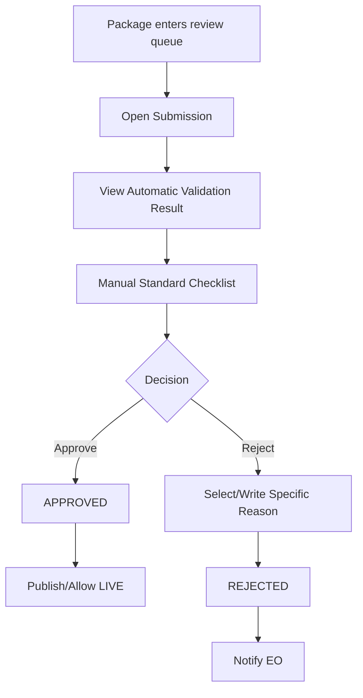
```mermaid
flowchart TD
    A[Package enters review queue] --> B[Open Submission]
    B --> C[View Automatic Validation Result]
    C --> D[Manual Standard Checklist]
    D --> E{Decision}

    E -- Approve --> F[APPROVED]
    F --> G[Publish/Allow LIVE]

    E -- Reject --> H[Select/Write Specific Reason]
    H --> I[REJECTED]
    I --> J[Notify EO]
```

## 11.3 EO Approval

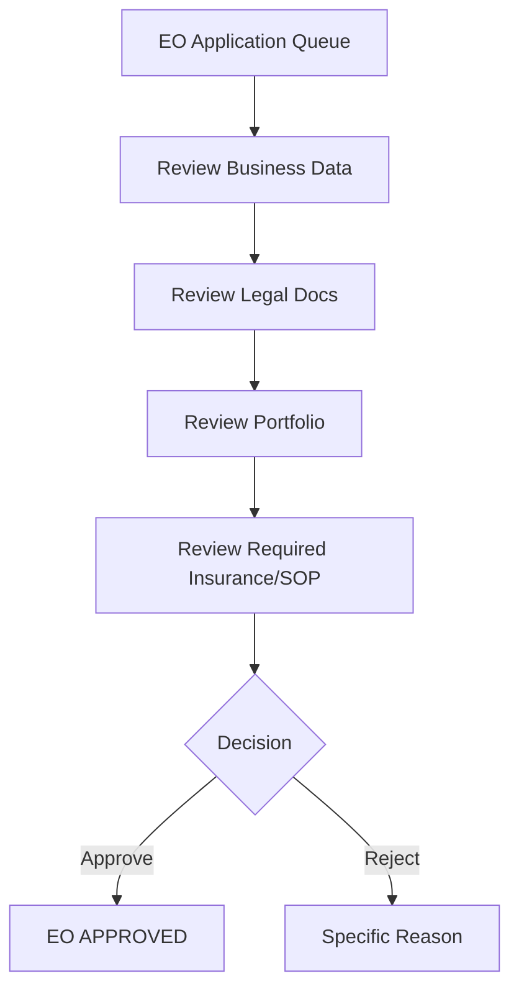
```mermaid
flowchart TD
    A[EO Application Queue] --> B[Review Business Data]
    B --> C[Review Legal Docs]
    C --> D[Review Portfolio]
    D --> E[Review Required Insurance/SOP]
    E --> F{Decision}
    F -- Approve --> G[EO APPROVED]
    F -- Reject --> H[Specific Reason]
```

## 11.4 Destination Verification

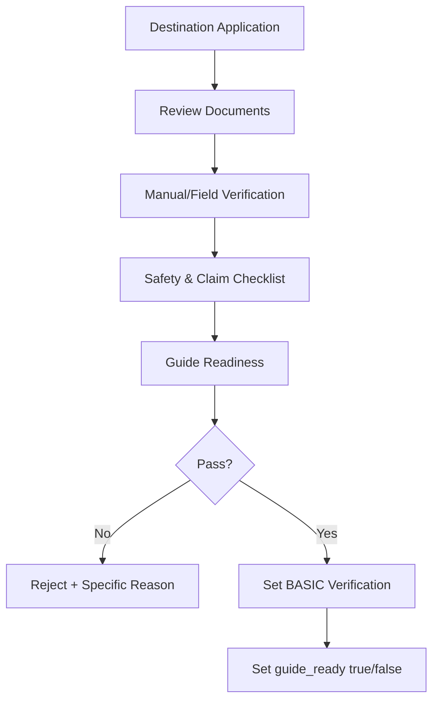
```mermaid
flowchart TD
    A[Destination Application] --> B[Review Documents]
    B --> C[Manual/Field Verification]
    C --> D[Safety & Claim Checklist]
    D --> E[Guide Readiness]
    E --> F{Pass?}
    F -- No --> G[Reject + Specific Reason]
    F -- Yes --> H[Set BASIC Verification]
    H --> I[Set guide_ready true/false]
```

---

# 12. Complaint, Trust & Suspension Flow

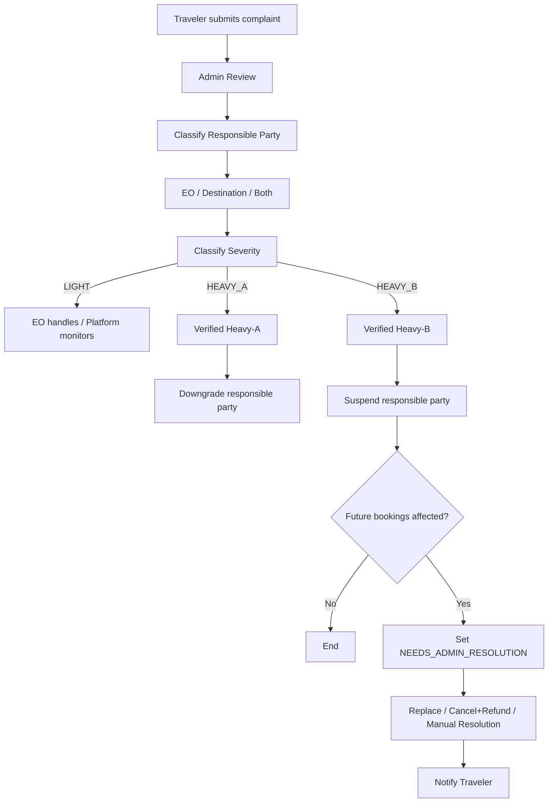
```mermaid
flowchart TD
    A[Traveler submits complaint] --> B[Admin Review]
    B --> C[Classify Responsible Party]
    C --> D[EO / Destination / Both]
    D --> E[Classify Severity]

    E -- LIGHT --> F[EO handles / Platform monitors]
    E -- HEAVY_A --> G[Verified Heavy-A]
    E -- HEAVY_B --> H[Verified Heavy-B]

    G --> I[Downgrade responsible party]
    H --> J[Suspend responsible party]

    J --> K{Future bookings affected?}
    K -- No --> L[End]
    K -- Yes --> M[Set NEEDS_ADMIN_RESOLUTION]
    M --> N[Replace / Cancel+Refund / Manual Resolution]
    N --> O[Notify Traveler]
```

**PENDING:** Heavy-B future booking may become automatic cancellation/refund instead of manual resolution.

---

# 13. Core State Machines

## 13.1 Traveler Onboarding

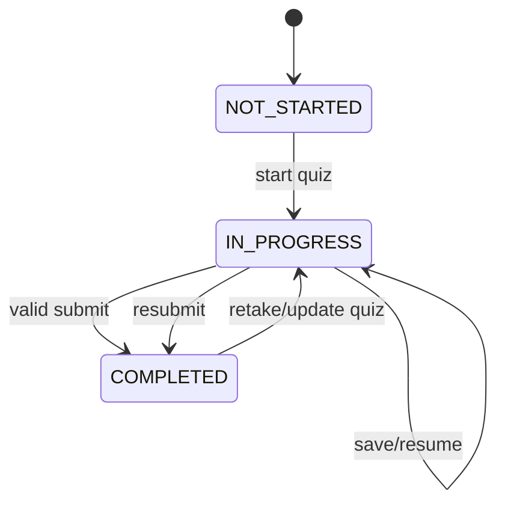
```mermaid
stateDiagram-v2
    [*] --> NOT_STARTED
    NOT_STARTED --> IN_PROGRESS: start quiz
    IN_PROGRESS --> COMPLETED: valid submit
    IN_PROGRESS --> IN_PROGRESS: save/resume
    COMPLETED --> IN_PROGRESS: retake/update quiz
    IN_PROGRESS --> COMPLETED: resubmit
```

## 13.2 EO Application

```mermaid
stateDiagram-v2
    [*] --> DRAFT
    DRAFT --> SUBMITTED
    SUBMITTED --> PENDING_REVIEW
    PENDING_REVIEW --> APPROVED
    PENDING_REVIEW --> REJECTED
    REJECTED --> DRAFT: edit/re-apply
```

## 13.3 Package

```mermaid
stateDiagram-v2
    [*] --> DRAFT
    DRAFT --> SUBMITTED
    SUBMITTED --> AUTO_REJECTED: validation fails
    AUTO_REJECTED --> DRAFT
    SUBMITTED --> PENDING_REVIEW: validation passes
    PENDING_REVIEW --> REJECTED
    REJECTED --> DRAFT
    PENDING_REVIEW --> APPROVED
    APPROVED --> LIVE
```

## 13.4 Session

```mermaid
stateDiagram-v2
    [*] --> DRAFT
    DRAFT --> OPEN
    OPEN --> FULL
    FULL --> OPEN: slot released
    OPEN --> CLOSED
    FULL --> CLOSED
    OPEN --> CANCELLED
    FULL --> CANCELLED
    CLOSED --> COMPLETED
```

## 13.5 Booking

```mermaid
stateDiagram-v2
    [*] --> PENDING_PAYMENT
    PENDING_PAYMENT --> PAID: verified success
    PENDING_PAYMENT --> CANCELLED: traveler cancel
    PENDING_PAYMENT --> EXPIRED: timeout
    PAID --> UPCOMING
    UPCOMING --> COMPLETED
    PAID --> REFUNDED: approved refund
    UPCOMING --> NEEDS_ADMIN_RESOLUTION: affected trust incident
    NEEDS_ADMIN_RESOLUTION --> REFUNDED
    NEEDS_ADMIN_RESOLUTION --> UPCOMING: replacement/resolved
```

## 13.6 Payment Attempt

```mermaid
stateDiagram-v2
    [*] --> PENDING
    PENDING --> SUCCEEDED
    PENDING --> FAILED
    PENDING --> CANCELLED
    PENDING --> EXPIRED
```

## 13.7 Fund Lifecycle

```mermaid
stateDiagram-v2
    [*] --> PAID
    PAID --> HELD
    HELD --> SPLIT
    SPLIT --> PAID_OUT
    PAID --> REFUNDED
    HELD --> REFUNDED
```

---

# 14. Screen Inventory — MVP

This section is the direct bridge from system flow to wireframe.

## 14.1 Traveler Screens

| ID | Screen | Priority | Main CTA / Action |
|---|---|---|---|
| T01 | Public Landing | Must | Mulai Cari Jedamu / Login |
| T02 | Login / Register | Must | Continue with Google / OTP / Email |
| T03 | Consent | Must | Setuju & Lanjut |
| T04 | Onboarding Quiz | Must | Next / Submit |
| T05 | Recommendation Result | Must | Lihat Experience |
| T06 | Logged-in Home | Must | Explore / Recommendation |
| T07 | Explore / Search / Filter | Must | Open Package |
| T08 | Trip Package Detail | Must | Pilih Jadwal |
| T09 | Choose Session | Must | Lanjut Checkout |
| T10 | Checkout Summary | Must | Bayar |
| T11 | Contact / Phone Verification | Must if needed | Verify |
| T12 | Pending Payment Resolution | Must | Continue / Cancel |
| T13 | Payment + Countdown | Must | Complete Payment |
| T14 | Payment Success | Must | Lihat Trip |
| T15 | Payment Failed / Expired | Must | Resolve / Back |
| T16 | My Trips | Must | Open Booking |
| T17 | Upcoming Trip Detail | Must | Trip Info |
| T18 | Completed Trip | Must | Beri Rating |
| T19 | Venue Rating | Must | Submit |
| T20 | EO/Guide Rating | Must | Submit |
| T21 | Profile | Should | Edit / Retake Quiz |
| T22 | Retake Quiz | Should | Update Preference |
| T23 | Complaint Form | Should/Must per demo scope | Submit Complaint |

## 14.2 EO Screens

| ID | Screen | Priority | Main CTA / Action |
|---|---|---|---|
| EO01 | Partner Landing / Role Selection | Must | Pilih EO |
| EO02 | EO Login / Register | Must | Login / Daftar EO |
| EO03 | EO Application Wizard | Must | Submit Application |
| EO04 | Application Status | Must | Edit/Re-apply if rejected |
| EO05 | Overview Dashboard | Must | Create Package |
| EO06 | Demand Insights | Must | Create Package from Insight |
| EO07 | Packages List | Must | Create/Open Package |
| EO08 | Builder — Destination | Must | Select Destination |
| EO09 | Builder — Insight | Must | Continue |
| EO10 | Builder — Itinerary | Must | Add Activity |
| EO11 | Builder — Pricing | Must | Set Margin |
| EO12 | Builder — Preview | Must | Submit for Review |
| EO13 | Validation Error | Must | Fix Draft |
| EO14 | Submission Status | Must | View Approval Result |
| EO15 | Package Detail / Version | Must | Manage Package |
| EO16 | Sessions List | Must | Create Session |
| EO17 | Create/Edit Session | Must | Save/Open Session |
| EO18 | Bookings | Should | View Booking |
| EO19 | Destinations Directory | Must | View/Select Destination |
| EO20 | Reviews | Should | View Feedback |
| EO21 | Profile & Guide Status | Should | View Status |

## 14.3 Destination Partner Screens

| ID | Screen | Priority | Main CTA / Action |
|---|---|---|---|
| DP01 | Partner Landing / Role Selection | Must | Pilih Pengelola Destinasi |
| DP02 | Destination Login / Register | Must | Login / Register |
| DP03 | Destination Application | Must | Submit |
| DP04 | Verification Status | Must | Re-apply if needed |
| DP05 | Overview Dashboard | Must | View Schedule |
| DP06 | Destination Profile | Must | Edit Draft Data |
| DP07 | Verification & Badge | Must | View Status |
| DP08 | Schedule / Sessions | Must | View Upcoming Usage |
| DP09 | Capacity | Must | View/Manage Capacity where allowed |
| DP10 | Reviews | Should | View Feedback |
| DP11 | Profile | Should | Edit Contact |

## 14.4 Admin Screens

| ID | Screen | Priority | Main CTA / Action |
|---|---|---|---|
| A01 | Admin Login | Must | Login |
| A02 | Overview Dashboard | Must | Open Queue |
| A03 | EO Approval Queue | Must | Review |
| A04 | EO Application Review | Must | Approve/Reject |
| A05 | Destination Verification Queue | Must | Review |
| A06 | Destination Verification Detail | Must | Approve/Reject + Guide Ready |
| A07 | Package Approval Queue | Must | Review |
| A08 | Package Review Checklist | Must | Approve/Reject |
| A09 | Bookings / Payments | Should | Inspect |
| A10 | Complaint Queue | Should/Must based demo | Review |
| A11 | Complaint Classification | Should/Must based demo | Confirm Severity/Party |
| A12 | Trust & Status | Should | Downgrade/Suspend/Inspect |
| A13 | Audit Activity | Should | Inspect Event |

---

# 15. Wireframe Build Order

Do **not** design all screens at once. Build in this order:

### Phase 1 — Traveler core

`T02 → T03 → T04 → T05 → T06 → T08 → T09 → T10 → T12 → T13 → T14 → T18 → T19 → T20`

### Phase 2 — EO differentiator

`EO05 → EO06 → EO08 → EO09 → EO10 → EO11 → EO12 → EO14`

### Phase 3 — Admin trust loop

`A02 → A07 → A08 → A06`

### Phase 4 — Partner operational support

`DP03 → DP04 → DP05 → DP08`

### Phase 5 — Supporting states

Search, My Trips, failed payment, rejected submission, profile, complaint, review history, and non-critical screens.

---

# 16. UI Direction

## 16.1 Traveler

- mobile-first,
- calm, trustworthy, contemporary,
- strong photography/experience imagery,
- recommendation explanation should be visible but not technical,
- concise CTAs,
- status banners should be obvious without feeling alarming.

Recommended logged-in Home modules:

```text
Greeting
Pending Payment Banner (conditional)
Upcoming Trip (conditional)
Search
Personal Recommendation
Explore by Mood
Popular This Week
From Your Departure Area
Verified Destinations
```

## 16.2 EO / Partner

- desktop-first dashboard,
- left sidebar,
- clear page hierarchy,
- tables/cards/charts,
- persistent primary CTA,
- Builder uses stepper,
- business-rule errors are inline and specific.

## 16.3 Admin

- information dense but readable,
- queues and filters,
- checklist-based decisions,
- every destructive/trust action requires clear reason/context,
- important status changes should show audit metadata.

---

# 17. Open Flow Decisions

These must be resolved before final high-fidelity prototype or production implementation:

1. Payment timeout exact value; current proposal 15 minutes.
2. Exact quiz questions and order.
3. Quiz scoring weight/match threshold.
4. Payment gateway selected for prototype/production.
5. Whether phone verification is mandatory for all accounts or only before first checkout.
6. Exact cancellation/refund policy.
7. Heavy-B future booking resolution: automatic vs manual.
8. Who marks a trip/session `COMPLETED` and when.
9. Whether EO session creation needs destination confirmation before `OPEN`.
10. Whether Mitra may directly edit capacity for sessions already published.
11. Which insight widgets are visible to external EO in the pilot.
12. Final admin approval checklist contents.

---

# 18. Definition of Flow Locked

A flow is considered **LOCKED** only when:

- happy path is documented,
- failure/cancel/expired state is documented,
- owner/role of each decision is known,
- resulting state is known,
- primary CTA on each required screen is known,
- unresolved business decisions are explicitly listed,
- no developer is required to invent a business rule during implementation.

Current status:

| Flow | Status |
|---|---|
| Traveler onboarding | LOCKED for wireframe |
| Traveler discovery | LOCKED for wireframe, scoring details pending |
| Pending payment guard | LOCKED for wireframe, timeout pending |
| Traveler review | LOCKED for wireframe |
| EO application | LOCKED for wireframe |
| EO Builder | LOCKED for wireframe, pricing values pending |
| Destination onboarding | LOCKED for wireframe |
| Admin package approval | LOCKED for wireframe |
| Complaint/suspension | PARTIALLY LOCKED |
| Refund policy | NOT LOCKED |
| Financial payout automation | NOT LOCKED / MVP may be simplified |

---

# 19. Next Product Artifact

After this document is accepted by the team, the next artifact is:

**`docs/WIREFRAME_SPEC.md`**

It should define per-screen:

- purpose,
- entry conditions,
- visible information,
- primary CTA,
- secondary actions,
- empty/loading/error states,
- navigation destination,
- responsive priority.

Only after the wireframe spec is stable should the team move to high-fidelity UI/design system.
